<h1>Alejandra González</h1>

Hi! I'm Alejandra González (*she / her*) a Rust programmer and tech enthusiast, you probably found me from [my contributions](https://github.com/search?q=org%3Arust-lang+author%3Ablyxyas&type=pullrequests) to the Rust Project, I also have a [cool blog](https://blog.goose.love/).

I:
- am a [Clippy team member](https://www.rust-lang.org/governance/teams/dev-tools#team-clippy) at [@rust-lang](https://github.com/rust-lang)
- am currently a [Project Goal](https://rust-lang.github.io/rust-project-goals/) owner, for ["Optimizing Clippy & Linting"](https://rust-lang.github.io/rust-project-goals/2024h2/optimize-clippy.html)
- Have been nominated for the [Google Open Source Peer Bonus award](https://opensource.google/documentation/reference/growing/peer-bonus).
- Have given some talks:
  - [RustChinaConf2025](https://www.bilibili.com/video/BV1yFn8z4E2m/)
  - [Kangrejos 2025](https://kangrejos.com/2025)
- Have been featured in Maintaine.rs, and the Rust Bytes Newsletter
- Have two beautiful cats, maybe the most important fact about me.

[You can check my "About me" page for cooler effects! (Please I wasted a lot of time just building that cool thing)](https://www.goose.love)

[If you're interested in what I do, checkout my CV! :heart:](https://github.com/blyxyas/Blyxyas/blob/main/Alejandra-Gonzalez-8-5-25-1.pdf)
